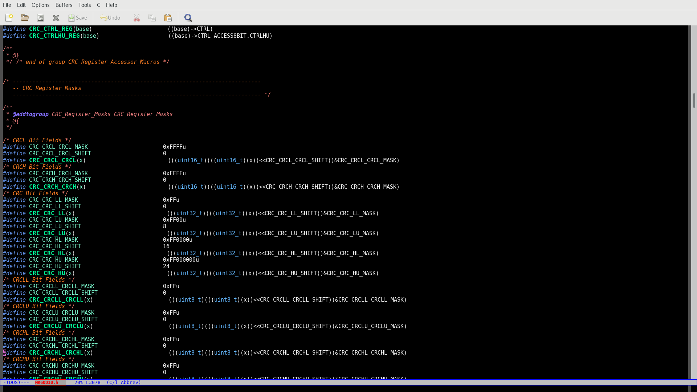
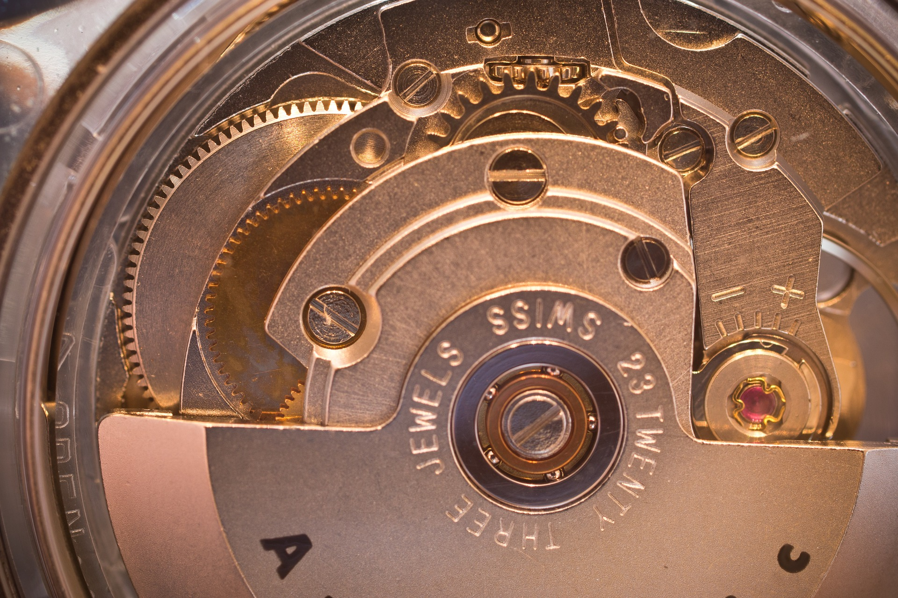

:source-highlighter: highlightjs
:customcss: dimbg.css
:revealjs_backgroundTransition: slide

[state=dimbg]
== The art of manufacturing types

[%notitle]
== ...

[state=dimbg]
[%notitle]
== Auto

`auto`

[state=dimbg]
[%notitle]
=== ...

`c++03`
[source,c++]
----
typedef PyMessageFactory::ClassesByMessageMap::iterator iterator;
for (iterator it = self->classes_by_descriptor->begin();
    it != self->classes_by_descriptor->end(); ++it) {
    ...
}
----

[state=dimbg]
[%notitle]
=== ...

`c++11`
[source,c++]
----
for(auto& item : *(self->classes_by_descriptor))
    ...
}
----

[state=dimbg]
[%notitle]
=== ...

`auto` all the things?

[state=dimbg]
[%notitle]
=== ...

was it signed, unsigned, 8/16/32/64 bits, happy? sad? +
[source,c++]
----
auto square(auto arg)
{ return arg*arg; }
----
¯\\_(ツ)_/¯

[state=dimbg]
[%notitle]
=== ...

no lambdas without `auto`
[source,c++]
----
const auto lambda = 
{ return arg*arg; };
----

[state=dimbg]
[%notitle]
=== ...
image::art/old-books-436498_1920.jpg[canvas]
i knew all of this, where are you going?

[state=dimbg]
== Factories

manufacture all the things!

[state=dimbg]
[%notitle]
=== ...
image::art/padlock-1346240_1920.jpg[canvas]
a lock factory

[source,c++]
----
constexpr auto make_lock(int key, int value) // -> (fn(int) -> std::optional<int>)
{
    return [key,value](auto _key) -> std::optional<int>
    {
        return key == _key ? std::make_optional(value) : std::nullopt;
    };
};
----

[state=dimbg]
[%notitle]
=== ...
image::art/padlock-1346240_1920.jpg[canvas]

[source,c++]
----
constexpr auto key     = 42;
constexpr auto value   = 1337;
constexpr auto my_lock = make_lock(key, value);
----

[state=dimbg]
[%notitle]
=== ...
image::art/padlock-1346240_1920.jpg[canvas]

[source,c++]
----
static_assert( std::nullopt == my_lock(84) );
static_assert( 1337         == my_lock(42) );
----

[state=dimbg]
[%notitle]
=== ...

what if we have one key, and want to try which lock it fits?

[state=dimbg]
[%notitle]
=== ...

[source,c++]
----
constexpr auto make_branch(auto left, auto right) // -> (fn(int) -> std::optional<int>)
{
    return [left,right](int key) -> std::optional<int>
    {
        const auto result = left(key)
        if( result != std::nullopt )
        {
            return result;
        }
        return right(key);
    };
};
----

[state=dimbg]
[%notitle]
=== ...

with some makeup
[source,c++]
----
constexpr auto lkup = make_lookup(
    map('A',13),
    map('B',55),
    map('C',87)
);

const int my_native_array[ lkup['B'] ];
----

[state=dimbg]
[%notitle]
=== ...

[source,c++]
----
constexpr auto ciaa = make_lookup(
    map(Register::PRA,    reg{0xBFE001, Width::B, Access::R}),
    map(Register::PRB,    reg{0xBFE101, Width::B, Access::R}),
    ...
);
----

[source,c++]
----
template<uint32_t reg_serialized>
inline uint32_t read_l() 
{
    constexpr auto r = reg{reg_serialized};
    static_assert(
        r.access() == Access::R
    );
    static_assert(
        r.width() == Width::L
    );
    return *reinterpret_cast<volatile const uint32_t*>(r.address());
}

constexpr auto pra = ciaa[Register::PRA];
const auto value   = read_l<pra>();
----

== DEMO HERE

== Thanks for listening
